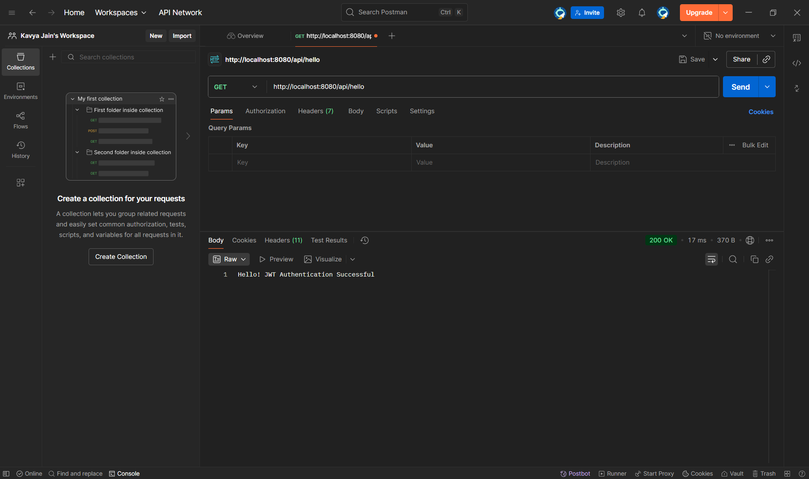
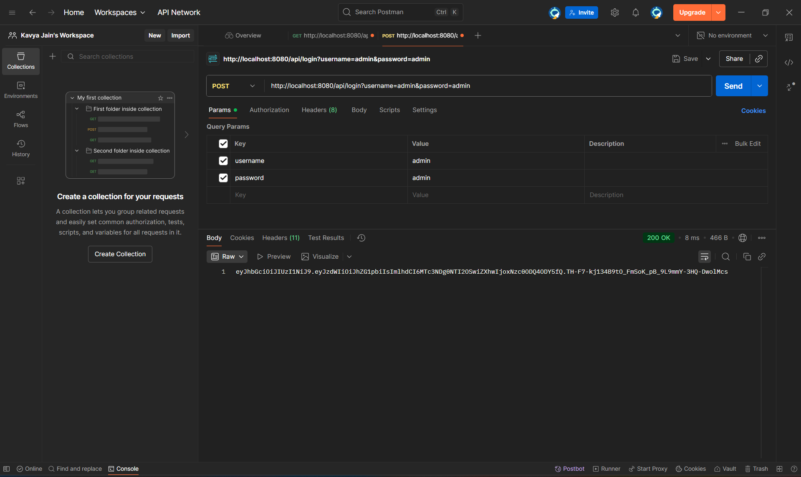

# JWT Authentication API (Spring Boot)

## 📌 Description

This project implements user authentication using **JWT (JSON Web Token)** in Spring Boot.
It allows users to log in and receive a secure token for authentication.

---

## ⚙️ Features

* User login authentication
* JWT token generation
* Stateless authentication
* Spring Security integration

---

## 🛠️ Technologies Used

* Java
* Spring Boot
* Spring Security
* JWT (io.jsonwebtoken)
* Maven

---

## 🚀 API Endpoints

### 🔹 Login API

```
POST /api/login
```

#### Request (x-www-form-urlencoded)

```
username = admin
password = admin
```

#### Response

```
JWT Token String
```

---

### 🔹 Test API

```
GET /api/hello
```

#### Response

```
Hello! JWT Authentication Successful
```

---

## 🧠 Working Flow

1. Client sends login request
2. Service validates credentials
3. JWT token is generated
4. Token is returned to client

---

## ⚠️ Note

* Currently uses **mock authentication (no database)**
* Can be extended using JPA for database integration

---

## ▶️ How to Run

1. Open project in Eclipse or VSCode
2. Run `JwtAuthApplication.java`
3. Test APIs using Postman or browser

---

## 🎓 Conclusion

This project demonstrates secure authentication using JWT in a Spring Boot application.


