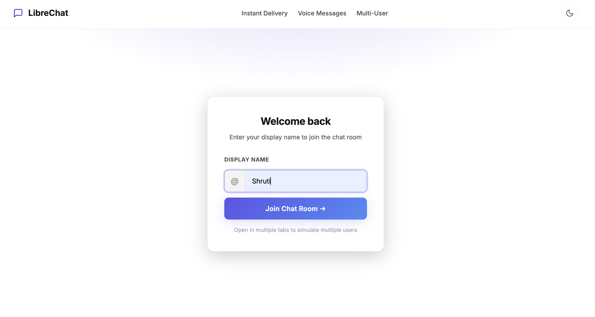
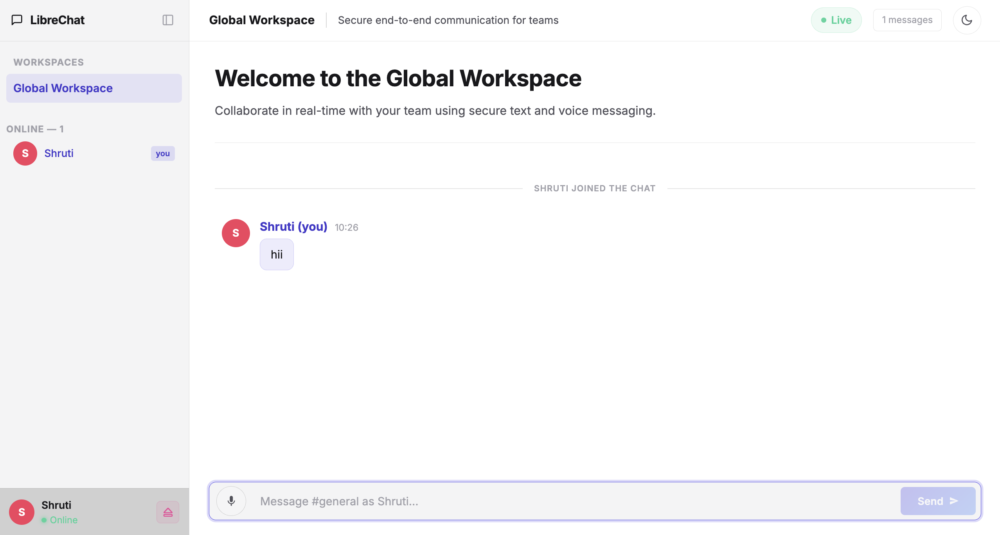
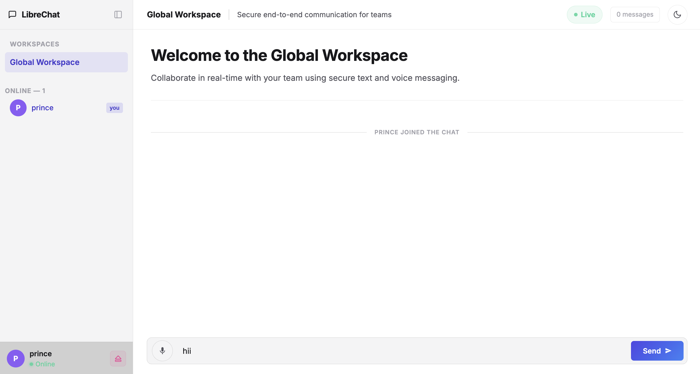
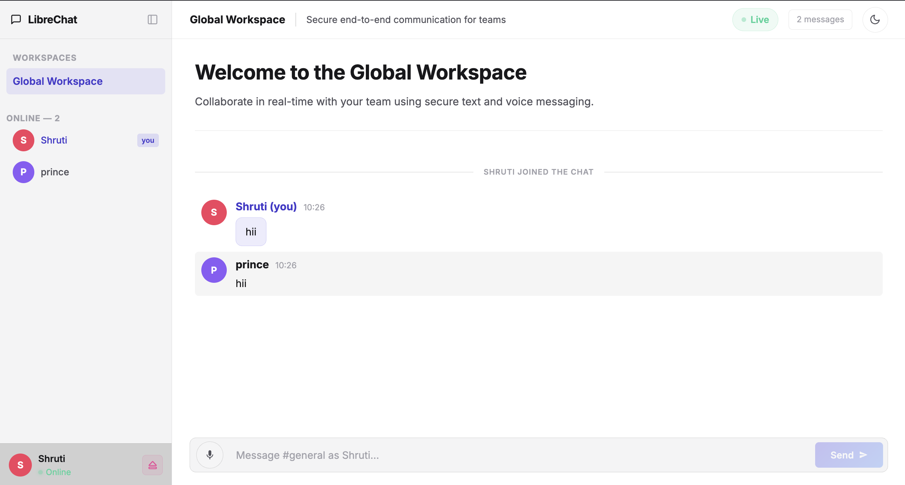

# 🌐 LibreChat — Enterprise WebSocket Workspace

LibreChat is a high-performance, professional real-time communication platform built on a modern full-stack architecture. It leverages **Spring Boot (Java 17)** and **React + Vite** to deliver a seamless, low-latency experience for team collaboration.

---

## 🚀 Key Features

*   **⚡ Real-Time Messaging**: Instant message delivery powered by STOMP over WebSockets.
*   **🎙️ Voice Communication**: Record and send voice memos directly in the global workspace.
*   **🌗 Adaptive Themes**: Fluid transition between professional Dark and Light modes.
*   **📱 Responsive Design**: Fully optimized for Desktop and Mobile workflows.
*   **📂 Workspace Management**: Collapsible sidebar with organized channels and live user presence.
*   **🔒 Secure & Reliable**: Built with industry-standard Spring Boot 3 security and SockJS fallbacks.

---

## 🛠️ Technology Stack

| Layer | Technology | Description |
| :--- | :--- | :--- |
| **Frontend** | React 18 + Vite | Modern UI with lightning-fast HMR |
| **Backend** | Spring Boot 3.2 | Enterprise-grade message handling |
| **Protocol** | STOMP + SockJS | Reliable messaging with WebSocket fallbacks |
| **Styling** | Vanilla CSS | Bespoke, premium design with zero bloating |
| **Logic** | JavaScript (ES6+) | Optimized frontend state management |

---

## 📸 Visual Walkthrough

<p align="center">
  
  
</p>
<p align="center">
  
  
</p>

---

## 📂 Project Architecture

```
LibreChat/
├── Websocketdev/          ← Spring Boot Backend (Java 17)
│   ├── pom.xml            ← Dependency Management
│   └── src/main/java/...  ← WebSocket & Message Logic
├── frontend/              ← React + Vite Frontend
│   ├── index.html         ← Entry Point
│   ├── src/App.jsx        ← Main Application Logic
│   └── src/App.css        ← Design System
└── README.md              ← You are here
```

---

## 🚦 Getting Started

### 1. Start the Backend (API & WebSocket)
Ensure you have **Java 17** installed.

```bash
cd Websocketdev/Websocketdev
# For macOS/Linux:
sh mvnw spring-boot:run
# For Windows:
mvnw.cmd spring-boot:run
```
*The server will initialize at `http://localhost:8080`.*

### 2. Launch the Frontend (UI)
Ensure you have **Node.js 18+** installed.

```bash
cd frontend
npm install
npm run dev
```
*The application will be live at `http://localhost:5173`.*

---

## 🧩 How It Works

1.  **Handshake**: The client initiates a SockJS connection at `/ws`.
2.  **Subscription**: Upon connecting, the client subscribes to `/topic/messages` for incoming global broadcasts.
3.  **Communication**: 
    *   **Text**: Messages are published to `/app/chat` in JSON format.
    *   **Voice**: Audio blobs are converted to Base64 and transmitted via the same WebSocket channel.
4.  **Broadcast**: The backend controller intercepts messages and relays them to all active subscribers instantly.

---

## 🤝 Support & Contribution

LibreChat is designed for extensibility. Feel free to explore the code, add new channels, or integrate persistent storage (PostgreSQL/MongoDB) for message history.

---

*Built with ❤️ by the LibreChat Team*
