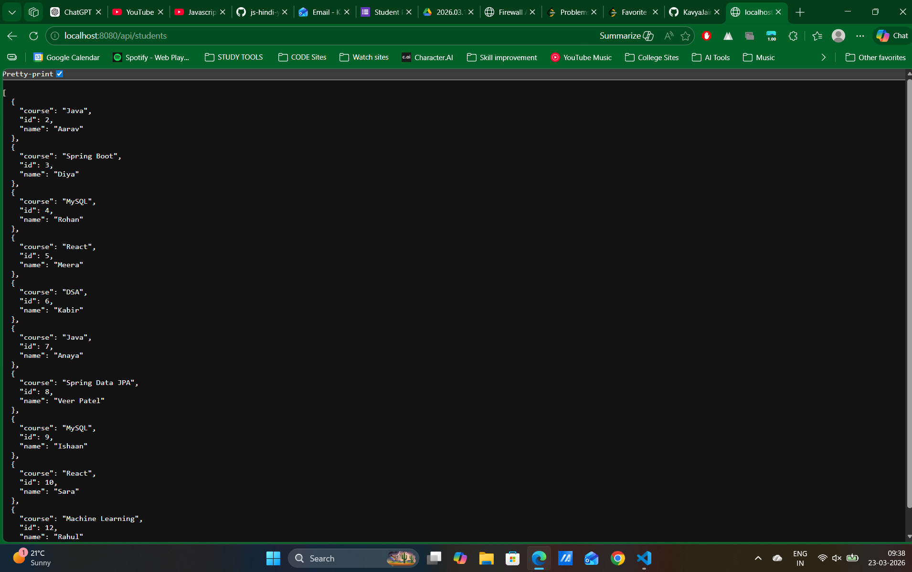
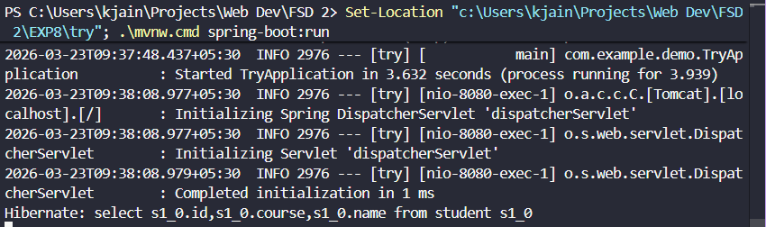

# EXP8 - Student Management REST API (Spring Boot)

This experiment contains a Spring Boot backend project for managing student records with full CRUD operations using MySQL and Spring Data JPA.

## Project Location

The runnable project is inside the `try` folder.

## Tech Stack

- Java 21
- Spring Boot 4
- Spring Web MVC
- Spring Data JPA
- MySQL
- Maven Wrapper (`mvnw` / `mvnw.cmd`)

## Features

- Create a student
- Read all students
- Read student by ID
- Update student details
- Delete a student

## API Base URL

`http://localhost:8080/api/students`

## Endpoints

- `GET /api/students` - Get all students
- `GET /api/students/{id}` - Get one student by ID
- `POST /api/students` - Create a new student
- `PUT /api/students/{id}` - Update an existing student
- `DELETE /api/students/{id}` - Delete a student

## Database Setup (MySQL)

1. Create database:

```sql
CREATE DATABASE spring_hibernate_db;
```

2. Open `try/src/main/resources/application.properties` and set your MySQL username/password if needed.

## Run the Project

From the `try` folder:

```bash
# Windows
mvnw.cmd spring-boot:run

# macOS/Linux
./mvnw spring-boot:run
```

The app runs on:

`http://localhost:8080`

## Screenshots

### Screenshot 1 (image)



### Screenshot 2 (image2)


